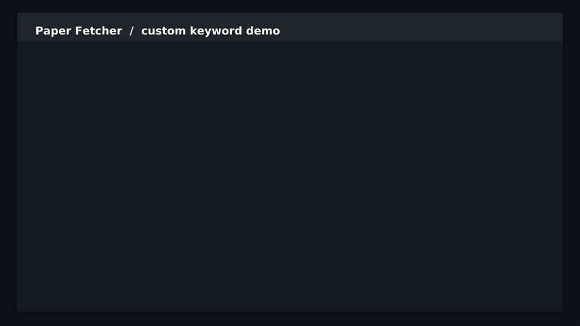

# Paper Fetcher

一个可复现的多来源论文检索 demo：按关键词从 arXiv、Semantic Scholar 和期刊 RSS 拉取论文，去重后生成 Markdown/JSON 日报；可选用 Ollama 或 Gemini 生成中文摘要，也可通过邮件发送。

## 视频 Demo

[](assets/demo.mp4)

> 点击动图可查看或下载 [MP4 原视频](assets/demo.mp4)。视频展示了如何自定义关键词、从 arXiv 获取候选论文并预览筛选结果。

视频中运行的命令只访问无需 API key 的 arXiv：

```bash
git clone https://github.com/Anqi00/paper-fetcher.git
cd paper-fetcher
python3 -m venv .venv
source .venv/bin/activate
python -m pip install -r requirements.txt

python fetcher.py \
  --query "visual localization" \
  --label "Visual Localization" \
  --max-papers 1 \
  --no-s2 --no-rss --dry-run
```

整个视频 Demo 默认不调用大模型、不发送邮件，也不需要配置任何密钥。去掉 `--dry-run` 后，程序会在 `output/` 中生成 Markdown 和 JSON。

## 功能

- 自定义一个或多个论文检索关键词
- arXiv、Semantic Scholar、期刊 RSS 三类公开数据源
- DOI/arXiv ID 去重、时间窗口扩展和已读缓存
- Markdown 与 JSON 输出
- `none`、本地 Ollama、Gemini 三种摘要后端
- 可选 cron 定时任务与 SMTP 邮件发送

## 快速开始

要求 Python 3.10+。

```bash
git clone https://github.com/Anqi00/paper-fetcher.git
cd paper-fetcher
python3 -m venv .venv
source .venv/bin/activate
python -m pip install -r requirements.txt
python fetcher.py --no-s2 --no-rss --dry-run
```

默认主题在 [`config.py`](config.py) 的 `TOPICS` 中。第一次运行建议使用 `--dry-run`，它不会写输出或更新已读缓存。默认 `SUMMARY_BACKEND=none`，不需要任何模型或密钥。

## 自定义关键词 demo

`--query` 可重复使用；只要提供一次，它就会替代 `config.py` 的默认主题：

```bash
python fetcher.py \
  --query "large language model agents" \
  --query "tool-augmented reasoning" \
  --label "LLM Agents" \
  --max-papers 5 \
  --no-rss \
  --dry-run
```

只用无需 key 的 arXiv 做最小复现：

```bash
python fetcher.py \
  --query "robotic apple harvesting" \
  --label "Orchard Robotics" \
  --max-papers 3 \
  --no-s2 --no-rss --no-cache
```

正式运行时去掉 `--dry-run`。结果会写入 `output/YYYY-MM-DD.md` 和 `output/YYYY-MM-DD.json`。

如需长期维护多组主题，可复制 `config.py` 中的主题对象并修改：

- `arxiv_queries`：发送给 arXiv 的检索词
- `s2_queries`：发送给 Semantic Scholar 的检索词
- `rss_keywords`：在 RSS 标题和摘要中做本地匹配的词
- `ARXIV_CATEGORIES`：限制 arXiv 分类，例如 `cs.CV`、`cs.RO`

## 开放 API 怎么用

本项目不提供代理服务，而是直接调用下列公开接口。

### arXiv API（无需 key）

安装依赖后，代码通过 `arxiv` Python 包访问 arXiv Atom API。最小调用：

```python
import arxiv

client = arxiv.Client(page_size=20, delay_seconds=3, num_retries=5)
search = arxiv.Search(
    query='all:"robotic pruning" AND (cat:cs.RO OR cat:cs.CV)',
    max_results=10,
    sort_by=arxiv.SortCriterion.SubmittedDate,
)
for paper in client.results(search):
    print(paper.title, paper.entry_id)
```

请遵守 [arXiv API 用户手册](https://info.arxiv.org/help/api/user-manual.html)与[使用条款](https://info.arxiv.org/help/api/tou.html)。官方建议连续请求之间至少等待 3 秒；本项目会在 arXiv 子查询之间等待 4 秒。

### Semantic Scholar Graph API（可无 key，推荐申请免费 key）

无 key 也能请求，但速率限制更严格。可从 [Semantic Scholar API 页面](https://www.semanticscholar.org/product/api)申请 key，接口字段以 [Graph API 文档](https://api.semanticscholar.org/api-docs/graph)为准。申请后通过环境变量传入：

```bash
export S2_API_KEY="your-key"
python fetcher.py --query "3D Gaussian splatting" --label "3DGS"
```

对应 HTTP 请求：

```python
import os
import requests

response = requests.get(
    "https://api.semanticscholar.org/graph/v1/paper/search",
    headers={"x-api-key": os.environ["S2_API_KEY"]},
    params={
        "query": "3D Gaussian splatting",
        "fields": "paperId,title,authors,abstract,publicationDate,venue,externalIds,openAccessPdf",
        "limit": 10,
    },
    timeout=30,
)
response.raise_for_status()
print(response.json()["data"])
```

### 期刊 RSS（无需 key）

RSS 地址维护在 `config.py` 的 `RSS_JOURNALS`。`feedparser.parse(url)` 获取条目，再由 `rss_keywords` 在本地筛选。不同出版商字段可能不一致，因此这里属于尽力解析。

## 可选摘要后端

复制环境变量模板；项目不会自动读取 `.env`，可用 shell `source` 导入：

```bash
cp .env.example .env
set -a
source .env
set +a
```

本地 Ollama（无需云 API key）：

```bash
ollama pull qwen2.5:7b
export SUMMARY_BACKEND=ollama
python fetcher.py --no-s2
```

Gemini：

```bash
export SUMMARY_BACKEND=gemini
export GEMINI_API_KEY="your-key"
python fetcher.py --no-s2
```

任何 key、邮箱应用密码都只应放在环境变量或被忽略的 `.env` 中，不要写进 `config.py`。

## 每日自动运行

```bash
chmod +x install_cron.sh
./install_cron.sh
```

脚本默认每天 08:00 运行并跳过 Semantic Scholar。日志和生成结果均在 `output/`，该目录默认不提交。修改 cron 前请确认虚拟环境中的 Python 路径和所需环境变量在非交互式 shell 中可用。

## 复现与验证

```bash
python -m compileall config.py fetcher.py
python -m unittest discover -s tests -v
python fetcher.py --help
python fetcher.py --query "visual localization" --label Demo --no-s2 --no-rss --dry-run
```

最后一条命令需要网络。公共 API 的索引会持续更新，因此检索结果不保证逐字相同；代码版本、关键词、日期、分类和固定依赖版本共同定义一次实验。JSON 的 `fetched_at` 记录抓取时间。

## 输出与隐私

生成结果、缓存、日志、虚拟环境和 `.env` 均已加入 `.gitignore`。公开仓库前仍建议运行一次密钥扫描，并检查论文摘要的使用是否符合相关数据源条款。

## License

[MIT](LICENSE)
